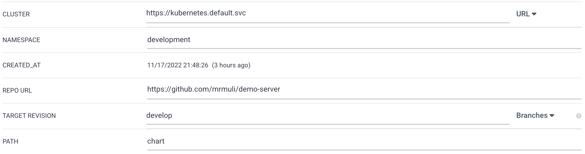
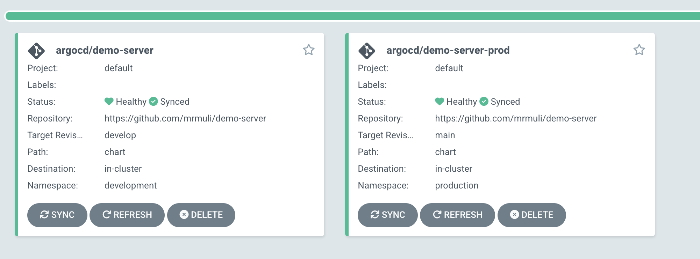

### demo server
This repository entails a simple demonstration application and helm chart.

Demonstration details are towards:
1. Deploying this application through ArgoCD (See below for deployment details)
2. Demonstrating environment specific Helm values where each environment has a separate values file.
3. Use of configmaps via a Helm chart dependency for separation of concern and standardization.
4. Use of SealedSecrets via a Helm chart dependency for encrypted secrets, separation of concern and standardization. For implementation details [see pull](https://github.com/mrmuli/demo-server/pull/7)
5. Kubernetes RBAC policy illustration.


### Requirements:
1. A kubernetes cluster, local testing is recommended for ease of use. Docker Desktop or any other preferred tool can serve.
2. Install the following list of packages, although MacOS specific, at least Linux flavors are guaranteed.
```
brew install kubeseal argocd helm(v3+)
```
3. Install the following Helm repositories:
```
helm repo add sealed-secrets https://bitnami-labs.github.io/sealed-secrets
helm repo add k8s-as-helm https://ameijer.github.io/k8s-as-helm
helm repo add bitnami https://charts.bitnami.com/bitnami
helm repo update # ensure these are up to date
```
4. Create the following namespaces **(one at a time or output this to a local yaml/json file for ease)**, feel free to adjust these but ensure your value files are aligned otherwise there would be confict. ArgoCD can create namespaces that don't exist but for consistency's sake, these should do.  
```
kubectl create namespace argocd development production
```

5. Install ArgoCD:
```
kubectl apply -n argocd -f https://raw.githubusercontent.com/argoproj/argo-cd/stable/manifests/install.yaml
```
6. Install the sealed secrets controller:
```
helm install sealed-secrets-controller --namespace kube-system --version 2.6.5 sealed-secrets/sealed-secrets
```
7. Retrieve the ArgoCD admin password:  
```
kubectl -n argocd get secret argocd-initial-admin-secret -o jsonpath="{.data.password}" | base64 -d; echo
```
8. Port forward the argoCD endpoint to a local port
```
kubectl port-forward svc/argocd-server -n argocd 8083:443
```
9. From `http://localhost:8083/` login with the credentials from step #7
10. Once you are logged in, create a new app and use the details on the screenshot below to resemble my deployment:  

11. Under the Directory dropdown, select **Helm** and pass the development values file.
12. You can create as many applications as you have environments. For this illustration 2 will do,
  